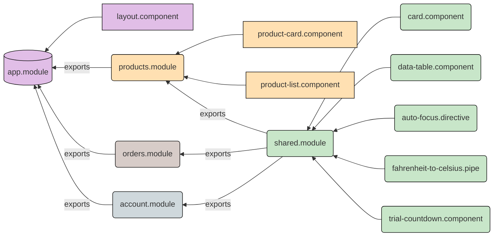

# Practical introduction to Angular

## Day 1


---
hideInToc: true
---

# Agenda

<Scroller>
    <Toc />
</Scroller>

---
layout: two-cols
---

# What is Angular?

Angular is a platform that makes it easy to build applications with the web. 

- Declarative templates
- Dependency injection
- End to end tooling
- Integrated best practices

::right::


---
layout: two-cols
---

# What is Typescript?

Typescript is a superset of Javascript.

- Expands the language of Javascript with types, enums, decorators and more
- TypeScript is used together with Angular
- [Typescript Playground](https://www.typescriptlang.org/play)

::right::


---
hideInToc: true
---

# Typescript example

```ts {1|3-8|10-14|16-19|21-24|all}
const myLanguage: 'js' | 'ts' = 'ts';

enum CodingSkill {
  Junior,    // 0
  Mid,       // 1
  Senior,    // 2
  Macaronni, // 3
}

interface Candidate {
  name: string;
  skill: CodingSkill;
  language: 'js' | 'ts';
}

const developer: Candidate {
  name: 'John Doe',
  skill: CodingSkill.Advanced,
  language: 'ts'
}

function evaluateCandidate(someCandidate: Candidate): boolean { ... };
```

---

# Workshop #1 - Creating an Angular project


<div grid="~ cols-2 gap-4">
<div>

0. Make sure you have NodeJS installed on your system:

    ```sh
    $ node -v
    ```

1. After NodeJS is installed in the system, install Angular CLI with:

    ```sh
    $ npm install -g @angular/cli
    ```

2. Create a new project with `ng new <project-name>`

    ```sh
    $ ng new workshop-project-1 # Creates an Angular project
    $ cd workshop-project-1 # Open the project directory
    $ ng serve # Serves the application
    ```

</div>
<div>
 
3. Add a bootstrap CSS library to the `index.html` file.  
   https://getbootstrap.com/docs/5.1/getting-started/introduction/

4. Use Google Fonts to add a custom font to the `index.html` file (weights 400, 700).
   https://fonts.google.com/

5. Change the default font-family used in `styles.css` file:

    ```css
    :root {
        --bs-font-sans-serif: 'YOUR FONT HERE', sans-serif;
    }
    ```

 
</div>
</div>

---
hideInToc: true
---

# Workshop #1 - Creating an Angular project

Commmon commands of the Angular CLI

- `ng serve` Hosts the project code for development on `http://localhost:4200`
- `ng build` Builds the project code for production
- `ng lint` Checks for code style errors
- `ng test` Runs tests contained in the project
- `ng generate` Generate code for building blocks)
  ```sh
  ng generate component product-card
  ```


---

# Project structure

```
- src/index.html
- src/styles.css
- src/main.ts
- src/assets/*
- src/environments/*
- package.json
- angular.json
- src/app/*
```

---
hideInToc: true
---

# Project structure - src/index.html

Contains the initial HTML code of the application.

```html
<!doctype html>
<html lang="en">
<head>
  <meta charset="utf-8">
  <title>NgWorkshop</title>
  <base href="/">
  <meta name="viewport" content="width=device-width, initial-scale=1">
  <link rel="icon" type="image/x-icon" href="favicon.ico">
</head>
<body>
  <app-root></app-root>
</body>
</html>
```

---
hideInToc: true
---

# Project structure - src/styles.css

Global styles of the application.

```css
/* You can add global styles to this file, and also import other style files */

body {
  font-family: 'Open Sans', sans-serif;
}
```


---
hideInToc: true
---

# Project structure - src/main.ts

Initializes the app by bootstrapping the AppModule

```ts {all|4|11-12|all|5-9}
import { enableProdMode } from '@angular/core';
import { platformBrowserDynamic } from '@angular/platform-browser-dynamic';

import { AppModule } from './app/app.module';
import { environment } from './environments/environment';

if (environment.production) {
  enableProdMode();
}

platformBrowserDynamic().bootstrapModule(AppModule)
  .catch(err => console.error(err));
```


---
hideInToc: true
---

# Project structure - src/environments/environment.ts

Environment specific data can be placed inside (development vs production).

```ts
// This file can be replaced during build by using the `fileReplacements` array.
// `ng build` replaces `environment.ts` with `environment.prod.ts`.
// The list of file replacements can be found in `angular.json`.

export const environment = {
  production: false
};
```


---
hideInToc: true
---

# Project structure - package.json

Metadata, dependencies and scripts of the project.

```json {all|4-11|12-16|17-21}
{
    "name": "ng-workshop",
    ...
    // Scripts to trigger various commands. For example: `npm run build`
    "scripts": {
        "serve": "ng serve",
        "build": "ng build",
        "lint": "ng lint",
        "test": "ng test",
        "e2e": "ng e2e"
    },
    "dependencies": {
        "@angular/**": "version number", // All Angular dependencies
        "rxjs": "version number", // Library to handle asynchronous data streams (remote data fetching, etc.)
        ...
    },
    "devDependencies": {
        "karma-*": "version number", // Test runner
        "jasmine-*": "version number", // Test assertion library
        ...
    }
}
```

---
hideInToc: true
---

# Project structure - angular.json

```ts {all|13|14-16|18-25|27-31|all}
{
  ...
  "defaultProject": "ng-workshop",
  "projects": {
    "ng-workshop": {
      ...
      "sourceRoot": "src",
      "prefix": "app",
      "architect": {
        "build": {
          "builder": "@angular-devkit/build-angular:browser",
          "options": {
            "outputPath": "dist/ng-workshop",
            "index": "src/index.html",
            "main": "src/main.ts",
            "polyfills": "src/polyfills.ts",
            "tsConfig": "tsconfig.app.json",
            "assets": [
              "src/favicon.ico",
              "src/assets"
            ],
            "styles": [
              "src/styles.css"
            ],
            "scripts": []
          },
          "configurations": {
            "production": { ... },
            "development": { ... }
          },
          "defaultConfiguration": "production"
        },
        "serve": { ... },
        "extract-i18n": { ... },
        "test": { ... }
      }
    }
  }
}
```

<style>
.shiki-container  {
  max-height: 400px;
  overflow: auto;
}
</style>

---
hideInToc: true
--- 

# Project structure - src/app folder


<div grid="~ cols-2 gap-4">
<div>

Majority of the application's logic will reside in the `src/app` folder.

By default Angular CLI adds: 
- `app.component`
- `app.module`

</div>
<div>


</div>
</div>

---
layout: center
class: text-center
hideInToc: true
---

# 10 minute break

<Countdown seconds="600" />

---


# Component based architecture


---

# Building blocks



---
hideInToc: true
---

# Building blocks - @NgModule


<div grid="~ cols-2 gap-4">
<div>

Classes with decorators

- Modules (can be included in imports[] or exports[])
  - `@NgModule`

</div>

<div> 


```ts
@NgModule({
  imports: [
    CommonModule,
    SharedModule,
    ...
  ],
  declarations: [
    ProductsListComponent,
    ProductCardComponent,
    ...
  ],
  providers: [ ProductsService, ... ],
  exports: [ ... ]
})
export class ProductsModule {}
```

</div>
</div>

<!--
Declares a compilation context for a set of components that is dedicated to an application domain, a workflow, or a closely related set of capabilities.
-->
 
---
hideInToc: true
---

# Building blocks - @Component


<div grid="~ cols-2 gap-4">
<div>

Classes with decorators

- Modules (can be included in imports[] or exports[])
  - `@NgModule`
- Declarables (must be included in declarations[], optionally in exports[])
  - `@Component`

</div>

<div> 

```ts
@Component({
  selector: 'app-product-card',
  template: `
    <h4>{{ product.name }}</h4>
    <span [class.text-red]="product.isOnSale">
      {{ product.price | currency }}
    </span>
    <br/>
    <button type="button" (click)="onBuyClick()">Buy now!</button>
  `,
})
export class ProductCardComponent {
  @Input() product: Product;
}
```

```html
<app-product-card [product]="products[0]"></app-product-card>
```

</div>
</div>

<!--
Defines a class that contains application data and logic, and is associated with an HTML template that defines a view to be displayed in a target environment.
-->

---
hideInToc: true
---

# Building blocks - @Directive


<div grid="~ cols-2 gap-4">
<div>

Classes with decorators

- Modules (can be included in imports[] or exports[])
  - `@NgModule`
- Declarables (must be included in declarations[], optionally in exports[])
  - `@Component`
  - `@Directive`


</div>
<div>


```ts
@Directive({ selector: '[appButton]', })
export class ButtonDirective {
  @Input() variant: 'primary' | 'secondary';

  @HostBinding('attr.disabled')
  @Input()
  isLoading = false;
}
```

```html
<button appButton [isLoading]="true">Place order</button>
```

</div>
</div>


---
hideInToc: true
---

# Building blocks - @Pipe


<div grid="~ cols-2 gap-4">
<div>

Classes with decorators

- Modules (can be included in imports[] or exports[])
  - `@NgModule`
- Declarables (must be included in declarations[], optionally in exports[])
  - `@Component`
  - `@Directive`
  - `@Pipe`


</div>
<div>

```ts
@Pipe({ name: 'likeEmoji', })
export class LikeEmojiPipe implements PipeTransform {
  transform(value: boolean): '👍' | '👎' {
    return value ? '👍' : '👎';
  }
}
```

```html
<div>{{ product.reviewScore > 5 | likeEmoji }}</div>
```

</div>
</div>

---
hideInToc: true
---
 
# Building blocks - @Injectable


<div grid="~ cols-2 gap-4">
<div>

Classes with decorators

- Modules (can be included in imports[] or exports[])
  - `@NgModule`
- Declarables (must be included in declarations[], optionally in exports[])
  - `@Component`
  - `@Directive`
  - `@Pipe`
- Injectables (can be included in providers[])
  - `@Injectable` (services, guards, interceptors, resolvers, etc...)


</div>
<div>

```ts
@Injectable({ providedIn: 'root', })
export class ProductsService {
  getAllProducts() {
    return [
      { id: 1, name: 'Nike Shoes', price: 1000 },
      { id: 2, name: 'Adidas Pants', price: 2000 },
    ];
  }
}
```

```ts
@Component({
  template: `
    Total products: {{ products.length }}<br/>

    <app-product-card
      *ngFor="let product of products"
      [product]="product
    ></app-product-card>`
})
export class ListComponent {
  products: Product[] = this.productsService.getAllProducts();

  constructor(private productsService: ProductsService) {} 
}
```
 
</div>
</div>

<!--
A service class definition is immediately preceded by the @Injectable() decorator. The decorator provides the metadata that allows other providers to be injected as dependencies into your class.
 -->

---

# Things to know about components

- Template syntax
- Property/Method decorators (`@Input`, `@Output`)
- Built-in directives (`*ngIf`, `*ngFor`)
- Lifecycle hooks (`ngOnInit`, `ngOnDestroy`)
- Styling/Encapsulation
- Content projection
- Change detection
 
---
layout: center
hideInToc: true
---
 
# Template syntax

---
layout: iframe
url: https://stackblitz.com/edit/angular-ivy-lqd9ao?file=src/app/app.component.html
---

---
hideInToc: true
---

# Template syntax

<section class="grid grid-cols-2 gap-4">

  ```html
  <input [value]="firstName">
  ```

  Binds property `value` to the result of expression `firstName`.

</section>

<section class="grid grid-cols-2 gap-4">

  ```html
  <div [attr.role]="myAriaRole">...</div>
  ```

  Binds attribute `role` to the result of expression `myAriaRole`.

</section>


<section class="grid grid-cols-2 gap-4">

  ```html
  <div [class.extra-sparkle]="isDelightful">...</div>
  ```

  Binds the presence of the CSS class `extra-sparkle` on the element to the truthiness of the expression `isDelightful`.

</section>

<section class="grid grid-cols-2 gap-4">

  ```html
  <div [style.width.px]="200">...</div>
  ```

  Binds style property width to the result of expression 200 in pixels. Units are optional.

</section>

---
hideInToc: true
---

# Template syntax

<section class="grid grid-cols-2 gap-4">

  ```html
  <button (click)="readRainbow($event)">...</button>
  ```
  
  Calls method `readRainbow` when a `click` event is triggered on this `<button>` element (or its children) and passes in the event object.
</section>


<section class="grid grid-cols-2 gap-4">

  ```html
  <div title="Hello {{ponyName}}">...</div>
  ```

  Binds a property to an interpolated string, for example,
  "Hello Seabiscuit". Equivalent to: `<div [title]="'Hello ' + ponyName">...</div>`

</section>

<section class="grid grid-cols-2 gap-4">

  ```html
  <p>Hello {{ponyName}}</p>
  ```

  Binds text content to an interpolated string, for example, "Hello Seabiscuit".
</section>

<section class="grid grid-cols-2 gap-4">

  ```html
  <app-component [(value)]="name">...</app-component>
  ```

  Sets up two-way data binding. Equivalent to:  
  `<app-component [value]="name" (value)="name = $event">...</app-component>`

</section>

---
hideInToc: true
---

# Template syntax


<section class="grid grid-cols-2 gap-4">

  ```html
  <video #videoRef ...></video>
  <button (click)="videoRef.play()">Play</button>
  ```

  Creates a local variable `videoRef` that provides access to the `<video>` element instance in data-binding and event-binding expressions in the current template.

</section>


<section class="grid grid-cols-2 gap-4">

  ```html
  <p>Card No.: {{ cardNumber | formatCardNumber }}</p>
  ```

  Transforms the current value of expression `cardNumber` via the pipe called `formatCardNumber`.

</section>


<section class="grid grid-cols-2 gap-4">

  ```html
  <p>Employer: {{ employer?.companyName }}</p>
  ```

  The optional chaining operator (?) means that the `employer` field can be `undefined`. If that's the case, the rest of the expression is handled without any errors.

</section>


---
hideInToc: true
---

# Template syntax

<section class="grid grid-cols-2 gap-4">

  ```html
  <p *myUnless="myExpression">...</p>
  ```

  <div>

  The `*` symbol turns the current element into an embedded template. Equivalent to: 

  ```html
  <ng-template [myUnless]="myExpression">
    <p>...</p>
  </ng-template>
  ```

  </div>
</section>

---
layout: center
hideInToc: true
---

# Property/Method decorators

---
layout: iframe
url: https://stackblitz.com/edit/angular-ivy-ncwwfc?file=src/app/fruit.component.ts
---

---
hideInToc: true
---

# Property/Method decorators - @Input()

Allows a property to be passed to a component.


```ts
@Component({
    template: `Name: {{ name }}, Email: {{ email }}`
})
export class AccountCardComponent {
    @Input() name: string;
    @Input() email: string;
}
```

Usage

```html
<app-account-card name="John Doe" email="email@example.com"></app-account-card>
```

---
hideInToc: true
---

# Property/Method decorators - @Output()

Used together with `new EventEmitter()` to fire events from a component.


```ts
@Component({
    template: `
        <ng-content></ng-content>
        <button (click)="answer.emit(false)">No</button>
        <button (click)="answer.emit(true)">Yes</button>
    `
})
export class QuestionComponent {
    @Output() answer = new EventEmitter<boolean>();
}
```

Usage

```html
<app-question (answer)="checkAnswer($event)">
    <p>Do you like melons?</p>
</app-question>
```

```ts
checkAnswer(answer: boolean) { ... }
```

---
hideInToc: true
---

# Property/Method decorators - @HostListener()

Allows to listen for events on the host element.

```ts
@Component({
    selector: 'app-order'
})
export class OrderComponent {
    @HostListener('click', ['$event'])
    onClick(event: MouseEvent) {
        // Clicked on <app-order> element
    }
}
```

---
hideInToc: true
---

# Property/Method decorators - @HostBinding()

Allows to set attributes on the host element

```ts
@Component({ selector: 'app-button' })
export class ButtonComponent {
    // Sets the role attribute on the host element
    // <app-button role="button">...</app-button>
    @HostBinding('role')
    readonly role = 'button';

    // Randomly assigns a width on the host element
    // <app-button style="width: 100px;">...</app-button>
    @HostBinding('style.width.px')
    get width(): number {
        return Math.random() > 0.5 ? 200 : 100;
    }

    // Adds `active` class on the host element if `active` property is true
    // <app-button [active]="true" class="active">...</app-button>
    @HostBinding('class.active')
    @Input()
    active = false;
}
```

---
hideInToc: true
---

# Property/Method decorators - @ViewChild()

Gets a reference to the component/element.

```ts
@Component({
  selector: 'app-account-card',
  template: `
      <p #paragraph>Name: {{ name }}</p>
  `,
})
export class AccountCard implements AfterViewInit {
  @Input() name: string;
  @ViewChild('paragraph')
  private paragraph: ElementRef<HTMLElement>;

  // After component is rendered
  ngAfterViewInit() {
    console.log(this.paragraph.nativeElement.innerHTML.length);
  }
}
```


---

# Workshop #2 - Creating an Restaurant card

Branch: `workshop-2-start`

<section class="grid grid-cols-[1fr,auto] gap-4">

<div>

1. ```sh
    ng generate module restaurants --module app
    ```

3. ```sh
    ng generate component restaurants/restaurant-card --export
    ```
   
   Data for the restaurant can be hard-coded in the `.html` file

4.  ```html
    <!-- app.component.html -->
    <app-restaurant-card
      imageUrl="xxx.jpg"
      name="Jammi Kebabai"
      address="Stoties g. 22"
      [distanceInKm]="4.5"
      [rating]="7.5"
    ></app-restaurant-card>
    ```

    Update the component with @Input() to pass properties listed above.


</div>


</section>


---
layout: center
class: text-center
hideInToc: true
---

# 5 minute break

<Countdown seconds="300" />

---
layout: center
class: text-center
---

# Built-in directives

Exported by CommonModule

---
layout: iframe
url: https://stackblitz.com/edit/angular-ivy-n2a9lv?embed=1&file=src/app/app.component.html
preload: false
---

---
hideInToc: true
---

# Built-in directives *ngIf

Displays given element if the expression is truthy.  
Accepts `else` to display a different template if expression is falsy.

```html
<ng-container *ngIf="isTrialOver; else daysLeftRef">
    Your trial has ended.
</ng-container>

<ng-template #daysLeftRef>
    Days left: {{ daysLeft }}
</ng-template>

```

---
hideInToc: true
---

# Built-in directives *ngFor

Allows to iterate over a collection of items and display them in the shared template.

```html
<ol>
    <li *ngFor="let task of tasks" [class.text-red]="task.isHighPriority">
        {{ task.title }} due: {{task.deadline}}
    </li>
</ol>
```

```ts
@Component(...)
export class TaskListComponent {
    tasks: Task[] = [
        { title: 'Task 1', deadline: '2020-01-01', isHighPriority: false },
        { title: 'Task 2', deadline: '2020-01-02', isHighPriority: true },
        { title: 'Task 3', deadline: '2020-01-03', isHighPriority: false },
    ];
}
```

---
hideInToc: true
---


# Built-in directives [ngSwitch], ngSwitchCase, ngSwitchDefault

Renders the template that matches the `ngSwitchCase`.  
If no match is found, displays the `ngSwitchDefault` template.

```html
<div [ngSwitch]="car.quality">
  <ng-template ngSwitchCase="new">The car is new and will be pricy</ng-template>
  <ng-template ngSwitchCase="used">The car is used</ng-template>
  <ng-template ngSwitchCase="broken">The car is not fit for driving</ng-template>
  <ng-template ngSwitchDefault>The car is fit for purchase</ng-template>
</div>
```

---
hideInToc: true
---

# Built-in directives [ngClass]

Applies classes if value is truthy.  
The right-hand expression should return `{ "class-name": true | false }`

```html
<div [ngClass]='{
    "text-bold": true,
    "text-green": car.price <= averageCarPrice
  }'>...</div>
```

---
hideInToc: true
---

# Built-in directives [ngStyle]

Applies style declarations to the expression result  
The right-hand expression should return `{ "declaration-name": ... }`

```html
<div [ngStyle]='{
    "font-size": "1.5em",
    "font-weight": "bold",
    "color": car.price > averageCarPrice ? "red" : "green"
  }'>...</div>
```

---

# Lifecycle hooks

After creating a component/directive by calling its constructor, Angular
calls the lifecycle hook methods in the following sequence at specific
moments:

```ts
export class AppComponent implements OnChanges, OnInit, OnDestroy, ... {
    // ! Common
    // ? Sometimes
    // - Rare

    constructor(...) { ... }                    // ! Called before any lifecycle hooks.
                                                //   Properties with @Input() are not yet set.

    ngOnChanges(changes: SimpleChanges) { ... } // ? Called after a bound input property changes & before first render
    ngOnInit() { ... }                          // ! Called before first render
    ngDoCheck() { ... }                         // - Called on every change detection run
    ngAfterContentInit() { ... }                // - Called after the content passed to the component has been initialized,
                                                //   but before the component template is fully rendered
    ngAfterContentChecked() { ... }             // - 
    ngAfterViewInit() { ... }                   // ? Called after in the component DOM is rendered
    ngAfterViewChecked() { ... }                // -
    ngOnDestroy() { ... }                       // ! Called before component is destroyed
}
```

---

# Workshop #3

List of restaurants  
Branch: `workshop-3-start`

<section class="grid grid-cols-[1fr,auto] gap-4">

<div>

1. Create a `restaurant-list` component in the restaurants module.
2. The `restaurant-list` should accept an array of restaurants:
    ```ts
    // src/app/interfaces/restaurant.ts
    export interface Restaurant { id: number; discount?: string; ... }

    // src/app/restaurants/restaurant-list.component.ts
    @Input() restaurants: Restaurant[];
    ```

3. Use *ngFor directive to display the list of restaurants.
4. Use *ngIf directive in `restaurant-card` component if a discount is in effect (-20%, "Free shipping", etc).

</div>


</section>

---

# Styling/Encapsulation

Encapsulated styles help to avoid component styles from "leaking out" to other parts of the app.

- Encapsulation, by default mangles the generated CSS class names.
- `:host` selector can be used to apply styles on the host element

```css
/* app.component.css */
:host {
    display: block;
}
```

- Use the `encapsulation` property in the `@Component()` decorator to change the behavior.

```ts
import { Component, ViewEncapsulation } from '@angular/core';

@Component({
    ...
    encapsulation: ViewEncapsulation.None
})
export class AppComponent {}
```

Read more: https://angular.io/guide/view-encapsulation

---

# Content projection

What if we want to add HTML content to the component? `<ng-content>` to the rescue!
 
<iframe style="width: 100%; height: 350px;" src="https://stackblitz.com/edit/angular-ivy-udezqd?file=src/app/app.component.html"></iframe>

Read more: https://angular.io/guide/content-projection

---

# Change detection

When Angular updates the HTML of the component

- Component is initialized
- Component properties change


- OnPush strategy as a performance optimization.  
    Although asynchronous code (setTimeout, HttpClient methods) will not trigger change detection.
    ```ts
    @Component({
        changeDetection: ChangeDetectionStrategy.OnPush
    })
    ```
- `ChangeDetectorRef.markForCheck` method can be used to trigger change detection manually.

    ```ts
    constructor(private cd: ChangeDetectorRef) {}

    ngOnInit() {
        this.dataService.getData().subscribe((response) => {
            this.data = response;
            this.cd.markForCheck(); // Triggers change detection
        })
    }
    ```
 
---
layout: iframe
url: https://stackblitz.com/edit/angular-ivy-ynf7t9?file=src%2Fapp%2Fcountdown%2Fcountdown.component.ts
---


--- 

# Pipes

Angular has a number of built in pipes. Most common are:

- **AsyncPipe** Unwraps a value from an asynchronous primitive, such as a Promise or Observable.
- **DatePipe** Formats a date value according to locale rules.
- **UpperCasePipe** Transforms text to all upper case.
- **LowerCasePipe** Transforms text to all lower case.
- **CurrencyPipe** Transforms a number to a currency string, formatted according to locale rules.
- **DecimalPipe** Transforms a number into a string with a decimal point, formatted according to locale rules.
- **PercentPipe** Transforms a number to a percentage string, formatted according to locale rules.

Usage:

```html
{{ 20.4 | currency }} <!-- $20.40 -->
{{ 20 | currency:'EUR':'1.1-2' }} <!-- €20.00 -->
```

Find out more on https://angular.io/guide/pipes

<!-- Pipes are useful -->

--- 

# Creating your own pipes

- Pipe is a declarable, therefore needs to be added to the `declarations[]` in the containing module.
- If pipe is intended to be used in other modules, it will need to be added to `exports[]` as well.

```ts
import { Pipe, PipeTransform } from '@angular/core';

@Pipe({ name: 'temperature' })
export class TemperaturePipe implements PipeTransform {
    transform(degrees: number, target: 'c' | 'f'): number {
       return target === 'c' 
         ? Math.round((degrees - 32) * 5 / 9) + '°C' 
         : Math.round(degrees * 9 / 5 + 32)   + '°F'
    }
}
```

Usage

```html
100 degrees in celsius: {{ 100 | temperature: 'c' }} <!-- 38°C  -->
100 degrees in fahrenheit: {{ 100 | temperature: 'f' | lowercase }} <!-- 212°f -->
```

---
layout: center
class: text-center
---

# Services

---

# Creating a service class

Add a `@Injectable({ providedIn: 'root' })` decorator above the class

<div class="grid grid-cols-2">

<div>

- Usually responsible for business logic
- Accessed through dependency injection

    ```ts
    export class HeaderComponent {
        isLoggedIn = this.userService.checkIfUserIsLoggedIn();

        constructor(private userService: UserService) {}

        logout() { this.userService.logout() }
    }
    ```

</div>

<div>

- Services can inject other services too

    ```ts
    @Injectable({ providedIn: 'root' })
    export class UserService {
        // Import HttpClient service (provided by HttpClientModule)
        constructor(private httpClient: HttpClient) {}

        getUserDetails(userId: number): Observable<User> {
            return this.httpClient.get<User>(`/api/users/${userId}`);
        }
    }
    ```

</div>

</div>


Observables might be useful for reactive properties (that change over time).  
More about Observables [here](https://www.youtube.com/watch?v=65Us8NwmYf4)

---
layout: iframe
url: https://stackblitz.com/edit/angular-ivy-7qn8cb?file=src/app/app.component.ts
---

---

# Workshop #4

Create a fake server to fetch remotely with `json-server`  
Branch: `workshop-4-start`

<Scroller>

1. Run `npm install json-server --save-dev`
2. Create a mock data file `mock-data.js` in the project root.
3. It should return mock data for the restaurants.
    ```js
    module.exports = () => {
        return {
            restaurants: [ ... ]
        }
    }
    ```
4. Create a script in `package.json`:
    ```json
    {
        "scripts": { 
            "server": "json-server mock-data.js --delay 1000"
        }
    }
5. Launch the server: `npm run server`
6. Create an api service `ng g service restaurants/restaurant-api`
7. Import `HttpClientModule` in `app.module.ts`
8. Inject `HttpClient` into `restaurant-api.service.ts`
9. Add a method that fetches the restaurants from the server

    ```ts
    @Injectable({ providedIn: 'root' })
    export class RestaurantApiService {
        constructor(private httpClient: HttpClient) {}

        getAll(): Observable<Restaurant[]> {
            return this.httpClient.get<Restaurant[]>('http://localhost:3000/restaurants');
        }
    }
    ```

10. Create an api service `ng g service restaurants/restaurant-api`
11. Import `HttpClientModule` in `app.module.ts`
12. Inject `HttpClient` into `restaurant-api.service.ts`
13. Add a method that fetches the restaurants from the server

    ```ts
    @Injectable({ providedIn: 'root' })
    export class RestaurantApiService {
        constructor(private httpClient: HttpClient) {}

        getAll(): Observable<Restaurant[]> {
            return this.httpClient.get<Restaurant[]>('http://localhost:3000/restaurants');
        }
    }
    ```

14. Inject the api service in the `app.component.ts`

    ```ts
    export class AppComponent {
        restaurants$ = this.restaurantApi.getAll();
        
        constructor(private restaurantApiService: RestaurantApiService) {}
    }
    ```

15. Use the `| async` pipe to display the data

    ```html
    <app-restaurant-list
      *ngIf="restaurants$ | async as restaurants; else loadingRef"
      [restaurants]="restaurants"
    ></app-restaurant-list>

    <ng-template #loadingRef>
        <output class="text-black-50">Loading...</output>    
    </ng-template>
    ```
</Scroller>

<style>
    .slidev-layout li {
        margin-left: 3ch;
    }
</style>

---
layout: center
class: text-center
---

# 10 minute break

<Countdown seconds="600" />

---

# Workshop #5

Custom pipes
Branch: `workshop-5-start`

1. Create a pipe `ng g pipe restaurants/pipes/stars`
2. It should transform a number 1-10 to star emojis
3. Used in the `restaurant-card` component should provide a result like so:

    ```html
    <!-- ⭐⭐⭐⭐⭐ if 10  -->
    <!-- ⭐ if <=2  -->
    {{ restaurant.rating | stars }}
    ```

---
layout: center
class: text-center
---

# Routing & Navigation

---

# RouterModule

TODO

The Angular Router enables navigation from one view to the next as users
perform application tasks.
- Part of @angular/router package
- Configured within RouterModule
- Projects components on router outlet

---

TODO Demo with stackblitz

---

# Things to know about routing

TODO

- Configuration
- Router outlet
- Router links
- Active router links
- ActivatedRoute state
- Router events
- Guards, Resolvers

---

# Workshop #6

Add routing (List, Detail, Create)

TODO  

<Scroller>

1. Define a route `restaurants` that will lazy load the routes contained in RestaurantsModule

    ```ts
    const routes: Route[] = [
        {
            path: 'restaurants',
            loadChildren: () => import('./restaurants/restaurants.module').then(m => m.RestaurantsModule)
        },
        { path: '**', redirectTo: 'restaurants' }
    ];

    @NgModule({
        imports: [
            ..., // remove RestaurantsModule from the imports
            RouterModule.forRoot(routes)
        ]
    })
    export class AppModule {}
    ```

2. Put `<router-outlet></router-outlet>` in the `app.component.html`.  
    It's placement will impact where the route is rendered in the DOM.

    ```html 
    <!-- app.component.html -->
    <router-outlet></router-outlet>
    ```

3. Add navigation in the `app.component.html`. It should underline the active url.

    ```html
    <!-- app.component.html -->
    <nav>
        <a routerLink="/restaurants" routerLinkActive="active">Home</a>
        <!-- Covered later -->
        <a routerLink="/restaurants/new" routerLinkActive="active">Add new restaurant</a>
    </nav>
    <router-outlet></router-outlet>
    ```

4. The lazy loaded module should a child route `''` which would display a list of restaurants:

    ```sh
    $ ng g c restaurants/pages/restaurants-page
    ```

    ```ts
    const routes: Route[] = [
        {
            path: '',
            component: RestaurantsPageComponent
        }
    ];

    @NgModule({
        imports: [
            ...,
            RouterModule.forChild(routes)
        ],
    })
    export class RestaurantsModule {}
    ```

5. Place the logic that displayed a list of restaurants to `RestaurantsPageComponent`. Clicking on a restaurant should navigate to the detail page.

    ```ts
    <app-restaurant-card
        *ngFor="let r of restaurants"
        [restaurant]="r"
        [routerLink]="[r.id]"
    ></app-restaurant-card>
    ```

6. Define a component & route for the page for restaurant create from. For example: `/restaurants/new`. The component itself can be empty for now.

   ```sh
    $ ng g c restaurants/pages/edit-restaurant-page
    ```

    ```ts
    {
        path: 'new',
        component: EditRestaurantPageComponent
    }
    ```

7. Define a component & route for the page of a single restaurant. For example: `/restaurants/:id`. The component itself can be empty for now.

    ```sh
    $ ng g c restaurants/pages/restaurant-page
    ```

    ```ts
    {
        path: ':id',
        component: RestaurantPageComponent,
        // guards
        canActivate: [RestaurantGuard], 
        // resolvers
        resolve: {
            restaurant: RestaurantResolver
         }
    }
    ```

8. Use a resolver to load the restaurant data by id from the url.

    ```ts
    @Injectable({ providedIn: 'root' })
    export class RestaurantResolver implements Resolve<Restaurant> {
        // Use the same api service to keep logic separated
        constructor(private apiService: RestaurantApiService) {}

        resolve(route: ActivatedRouteSnapshot): Observable<Restaurant> {
            const id = Number(route.params.id);
            return this.apiService.getOne(id);
        }
    }
    ```

9.  Use a guard to prevent navigation if `id` is not a number.  
    For example: `/restaurants/something-else`.

    ```ts
    @Injectable({ providedIn: 'root' })
    export class RestaurantGuard implements CanActivate {
        canActivate(route: ActivatedRouteSnapshot): boolean {
            const id = Number(route.params.id);
            return !isNaN(id);
        }
    }
    ```

10. Retrieve the resolved restaurant data from `ActivatedRoute` & display detailed restaurant information inside the restaurant's page:

    <div class="grid grid-cols-2 gap-4">

    ```ts
    // restaurant-page.component.ts
    @Component(...)
    export class RestaurantPageComponent {
        restaurant$ = this.route.data.pipe(
            map(data => data.restaurant)
        );

        constructor(private route: ActivatedRoute) {}
    }

    ```

    ```html
    <!-- restaurant-page.component.html -->
    <ng-container *ngIf="restaurant$ | async as restaurant">
        {{ restaurant.name }}
        {{ restaurant.rating | stars }}

        {{ restaurant.description }}
    </ng-container>
    ```

    </div>
    
   

</Scroller>