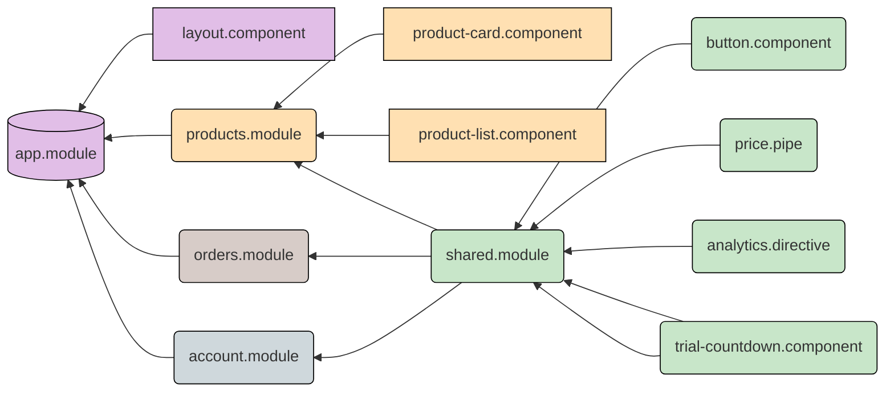

# Practical introduction to Angular

## Day 1
 

<!--
The last comment block of each slide will be treated as slide notes. It will be visible and editable in Presenter Mode along with the slide. [Read more in the docs](https://sli.dev/guide/syntax.html#notes)
-->

---
hideInToc: true
---

# Agenda

<Toc />

---
layout: image-right
image: https://upload.wikimedia.org/wikipedia/commons/thumb/c/cf/Angular_full_color_logo.svg/1200px-Angular_full_color_logo.svg.png
---

# What is Angular?

Angular is a platform that makes it easy to build applications with the web. 

- Declarative templates
- Dependency injection
- End to end tooling
- Integrated best practices

Angular empowers developers to build applications that live on the web, mobile, or the desktop.

---
layout: image-right
image: https://mblogthumb-phinf.pstatic.net/MjAxOTA5MThfMjUz/MDAxNTY4Nzc1NjcwODU4.xFOImjrZShTTuPsRzemtz1FI-RCuruHnMEEGZL3BOEUg.ZQ0MifFlaaGRKn6bmbFCsujHt2kC2V1wQv0hmigWuO4g.PNG.bluesky4381/TypeScript_JavaScript.png?type=w800
---

# What is Typescript?

Typescript is a superset of Javascript.

- Expands the language of Javascript with types, enums, decorators and more
- TypeScript is used together with Angular
- [Typescript Playground](https://www.typescriptlang.org/play)

---
hideInToc: true
---

# Typescript example

```ts {1|3-8|10-14|16-19|21-24|all}
const myLanguage: 'js' | 'ts' = 'ts';

enum CodingSkill {
  Junior,    // 0
  Mid,       // 1
  Senior,    // 2
  Macaronni, // 3
}

interface Candidate {
  name: string;
  skill: CodingSkill;
  language: 'js' | 'ts';
}

const developer: Candidate {
  name: 'John Doe',
  skill: CodingSkill.Advanced,
  language: 'ts'
}

function evaluateCandidate(someCandidate: Candidate): boolean { ... };
```

---

# Workshop #1 - Creating an Angular project

The Angular CLI makes it easy to create an application that already works,
right out of the box.

<div grid="~ cols-2 gap-4">
<div>

0. Make sure you have NodeJS installed on your system:

    ```sh
    $ node -v
    ```

1. After NodeJS is installed in the system, install Angular CLI with:

    ```sh
    $ npm install -g @angular/cli
    ```

2. Create a new project with `ng new <project-name>`

    ```sh
    $ ng new workshop-project-1 # Creates an Angular project
    $ cd workshop-project-1 # Open the project directory
    $ ng serve # Serves the application
    ```

</div>
<div>

Commmon commands of the Angular CLI

- `ng serve` Hosts the project code for development on `http://localhost:4200`
- `ng build` Builds the project code for production
- `ng lint` Checks for code style errors
- `ng test` Runs tests contained in the project
- `ng generate` Generate code for building blocks)
  ```sh
  ng generate component product-card
  ```


</div>
</div>

---

# Project structure

```
- src/index.html
- src/styles.css
- src/main.ts
- src/assets/*
- src/environments/*
- angular.json
- src/app/*
```

---
hideInToc: true
---

# Project structure - src/index.html

```html
<!doctype html>
<html lang="en">
<head>
  <meta charset="utf-8">
  <title>NgWorkshop</title>
  <base href="/">
  <meta name="viewport" content="width=device-width, initial-scale=1">
  <link rel="icon" type="image/x-icon" href="favicon.ico">
</head>
<body>
  <app-root></app-root>
</body>
</html>
```

---
hideInToc: true
---

# Project structure - src/styles.css

```css
/* You can add global styles to this file, and also import other style files */

body {
  font-family: 'Open Sans', sans-serif;
}
```


---
hideInToc: true
---

# Project structure - src/main.ts

```ts {all|4|11-12|all|5-9}
import { enableProdMode } from '@angular/core';
import { platformBrowserDynamic } from '@angular/platform-browser-dynamic';

import { AppModule } from './app/app.module';
import { environment } from './environments/environment';

if (environment.production) {
  enableProdMode();
}

platformBrowserDynamic().bootstrapModule(AppModule)
  .catch(err => console.error(err));
```


---
hideInToc: true
---

# Project structure - src/environments/environment.ts

```ts
// This file can be replaced during build by using the `fileReplacements` array.
// `ng build` replaces `environment.ts` with `environment.prod.ts`.
// The list of file replacements can be found in `angular.json`.

export const environment = {
  production: false
};
```

---
hideInToc: true
---

# Project structure - angular.json

```ts {all|13|14-16|18-25|27-31|all}
{
  ...
  "defaultProject": "ng-workshop",
  "projects": {
    "ng-workshop": {
      ...
      "sourceRoot": "src",
      "prefix": "app",
      "architect": {
        "build": {
          "builder": "@angular-devkit/build-angular:browser",
          "options": {
            "outputPath": "dist/ng-workshop",
            "index": "src/index.html",
            "main": "src/main.ts",
            "polyfills": "src/polyfills.ts",
            "tsConfig": "tsconfig.app.json",
            "assets": [
              "src/favicon.ico",
              "src/assets"
            ],
            "styles": [
              "src/styles.css"
            ],
            "scripts": []
          },
          "configurations": {
            "production": { ... },
            "development": { ... }
          },
          "defaultConfiguration": "production"
        },
        "serve": { ... },
        "extract-i18n": { ... },
        "test": { ... }
      }
    }
  }
}
```

<style>
.shiki-container  {
  max-height: 400px;
  overflow: auto;
}
</style>

---
hideInToc: true
--- 

# Project structure - src/app folder


<div grid="~ cols-2 gap-4">
<div>

Majority of the application's logic will reside in the `src/app` folder.

By default Angular CLI generates an `app.component` and `app.module` in the `src/app` folder.

</div>
<div>


</div>
</div>

---
layout: center
class: text-center
hideInToc: true
---

# 10 minute break

<Countdown seconds="600" />

---


# Component based architecture


---

# Building blocks


<div class="grid grid-cols-3 gap-10 pt-4 -mb-6">



</div>

---
hideInToc: true
---

# Building blocks - @NgModule


<div grid="~ cols-2 gap-4">
<div>

Classes with decorators

- Modules
  - @NgModule

</div>

<div> 


```ts
@NgModule({
  imports: [
    CommonModule,
    SharedModule,
    ...
  ],
  declarations: [
    ProductsListComponent,
    ProductCardComponent,
    ...
  ],
  providers: [ ProductsService, ... ],
  exports: [ ... ]
})
export class ProductsModule {}
```

</div>
</div>

<!--
Declares a compilation context for a set of components that is dedicated to an application domain, a workflow, or a closely related set of capabilities.
-->
 
---
hideInToc: true
---

# Building blocks - @Component


<div grid="~ cols-2 gap-4">
<div>

Classes with decorators

- Modules
  - @NgModule
- Declarables
  - @Component

</div>

<div> 

```ts
@Component({
  selector: 'app-product-card',
  template: `
    <h4>{{ product.name }}</h4>
    <span [class.text-red]="product.isOnSale">
      {{ product.price | currency }}
    </span>
    <br/>
    <button type="button" (click)="onBuyClick()">Buy now!</button>
  `,
})
export class ProductCardComponent {
  @Input() product: Product;
}
```

```html
<app-product-card [product]="products[0]"></app-product-card>
```

</div>
</div>

<!--
Defines a class that contains application data and logic, and is associated with an HTML template that defines a view to be displayed in a target environment.
-->

---
hideInToc: true
---

# Building blocks - @Directive


<div grid="~ cols-2 gap-4">
<div>

Classes with decorators

- Modules
  - @NgModule
- Declarables
  - @Component
  - @Directive


</div>
<div>


```ts
@Directive({ selector: '[appButton]', })
export class ButtonDirective {
  @Input() variant: 'primary' | 'secondary';

  @HostBinding('attr.disabled')
  @Input()
  isLoading = false;
}
```

```html
<button appButton [isLoading]="true">Place order</button>
```

</div>
</div>


---
hideInToc: true
---

# Building blocks - @Pipe


<div grid="~ cols-2 gap-4">
<div>

Classes with decorators

- Modules
  - @NgModule
- Declarables
  - @Component
  - @Directive
  - @Pipe


</div>
<div>

```ts
@Pipe({ name: 'likeEmoji', })
export class LikeEmojiPipe implements PipeTransform {
  transform(value: boolean): '👍' | '👎' {
    return value ? '👍' : '👎';
  }
}
```

```html
<div>{{ product.reviewScore > 5 | likeEmoji }}</div>
```

</div>
</div>

---
hideInToc: true
---
 
# Building blocks - @Injectable


<div grid="~ cols-2 gap-4">
<div>

Classes with decorators

- Modules
  - @NgModule
- Declarables
  - @Component
  - @Directive
  - @Pipe
- Injectables
  - @Injectable (services, guards, interceptors, resolvers, etc...)


</div>
<div>

```ts
@Injectable({ providedIn: 'root', })
export class ProductsService {
  getAllProducts() {
    return [
      { id: 1, name: 'Nike Shoes', price: 1000 },
      { id: 2, name: 'Adidas Pants', price: 2000 },
    ];
  }
}
```

```ts
@Component({
  template: `
    Total products: {{ products.length }}<br/>

    <app-product-card
      *ngFor="let product of products"
      [product]="product
    ></app-product-card>`
})
export class ListComponent {
  products: Product[] = this.productsService.getAllProducts();

  constructor(private productsService: ProductsService) {} 
}
```
 
</div>
</div>

<!--
A service class definition is immediately preceded by the @Injectable() decorator. The decorator provides the metadata that allows other providers to be injected as dependencies into your class.
 -->
 
---
layout: center
---
 
# Template syntax

---
layout: iframe
url: https://stackblitz.com/edit/angular-ivy-lqd9ao?file=src/app/app.component.html
---

---
hideInToc: true
---

# Template syntax

<section class="grid grid-cols-2 gap-4">

  ```html
  <input [value]="firstName">
  ```

  Binds property `value` to the result of expression `firstName`.

</section>

<section class="grid grid-cols-2 gap-4">

  ```html
  <div [attr.role]="myAriaRole">...</div>
  ```

  Binds attribute `role` to the result of expression `myAriaRole`.

</section>


<section class="grid grid-cols-2 gap-4">

  ```html
  <div [class.extra-sparkle]="isDelightful">...</div>
  ```

  Binds the presence of the CSS class `extra-sparkle` on the element to the truthiness of the expression `isDelightful`.

</section>

<section class="grid grid-cols-2 gap-4">

  ```html
  <div [style.width.px]="200">...</div>
  ```

  Binds style property width to the result of expression 200 in pixels. Units are optional.

</section>

---
hideInToc: true
---

# Template syntax

<section class="grid grid-cols-2 gap-4">

  ```html
  <button (click)="readRainbow($event)">...</button>
  ```
  
  Calls method `readRainbow` when a `click` event is triggered on this `<button>` element (or its children) and passes in the event object.
</section>


<section class="grid grid-cols-2 gap-4">

  ```html
  <div title="Hello {{ponyName}}">...</div>
  ```

  Binds a property to an interpolated string, for example,
  "Hello Seabiscuit". Equivalent to: `<div [title]="'Hello ' + ponyName">...</div>`

</section>

<section class="grid grid-cols-2 gap-4">

  ```html
  <p>Hello {{ponyName}}</p>
  ```

  Binds text content to an interpolated string, for example, "Hello Seabiscuit".
</section>

<section class="grid grid-cols-2 gap-4">

  ```html
  <app-component [(value)]="name">...</app-component>
  ```

  Sets up two-way data binding. Equivalent to:  
  `<app-component [value]="name" (value)="name = $event">...</app-component>`

</section>

---
hideInToc: true
---

# Template syntax


<section class="grid grid-cols-2 gap-4">

  ```html
  <video #videoRef ...></video>
  <button (click)="videoRef.play()">Play</button>
  ```

  Creates a local variable `videoRef` that provides access to the `<video>` element instance in data-binding and event-binding expressions in the current template.

</section>


<section class="grid grid-cols-2 gap-4">

  ```html
  <p>Card No.: {{ cardNumber | formatCardNumber }}</p>
  ```

  Transforms the current value of expression `cardNumber` via the pipe called `formatCardNumber`.

</section>


<section class="grid grid-cols-2 gap-4">

  ```html
  <p>Employer: {{ employer?.companyName }}</p>
  ```

  The optional chaining operator (?) means that the `employer` field can be `undefined`. If that's the case, the rest of the expression is handled without any errors.

</section>


---
hideInToc: true
---

# Template syntax

<section class="grid grid-cols-2 gap-4">

  ```html
  <p *myUnless="myExpression">...</p>
  ```

  <div>

  The `*` symbol turns the current element into an embedded template. Equivalent to: 

  ```html
  <ng-template [myUnless]="myExpression">
    <p>...</p>
  </ng-template>
  ```

  </div>


</section>


---
layout: center
---

# Built-in directives

---
layout: iframe
url: https://stackblitz.com/edit/angular-ivy-n2a9lv?embed=1&file=src/app/app.component.html
preload: false
---

---

# Built-in directives

By importing the CommonModule (or BrowserModule in app.module.ts), the following directives are available:


## Built-in directives *ngIf

Removes or recreates a portion of the DOM tree based on

the showSection expression.

```html
<section *ngIf="isTrialOver">...</section>
```

## Built-in directives *ngFor

Turns the li element and its contents into a template, and
uses that to instantiate a view for each item in list.

```html
<li *ngFor="let product of products; let i = index">#{{index}} {{product.name}}</li>
```

## Built-in directives [ngSwitch], ngSwitchCase, ngSwitchDefault

Conditionally swaps the contents of the div by selecting one
of the embedded templates based on the current value of
conditionExpression.

```html
<div [ngSwitch]="car.quality">
  <ng-template [ngSwitchCase]="'new'">The car is new and will be pricy</ng-template>
  <ng-template ngSwitchCase="used">The car is used</ng-template>
  <ng-template ngSwitchCase="broken">The car is not fit for driving</ng-template>
  <ng-template ngSwitchDefault>The car costs {{ car.price }}</ng-template>
</div>
```

## Built-in directives [ngClass]

Binds the presence of CSS classes on the element to the
truthiness of the associated map values. The right-hand
expression should return {class-name: true/false} map.

## Built-in directives [ngStyle]

Allows you to assign styles to an HTML element using CSS.
You can use CSS directly, as in the first example, or you can
call a method from the component.
